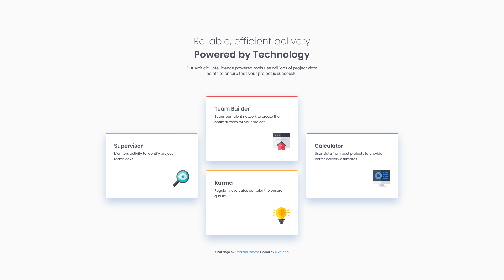

# Frontend Mentor - Four card feature section solution

This is a solution to the [Four card feature section challenge on Frontend Mentor](https://www.frontendmentor.io/challenges/four-card-feature-section-weK1eFYK). Frontend Mentor challenges help you improve your coding skills by building realistic projects. 

## Table of contents

- [Overview](#overview)
  - [The challenge](#the-challenge)
  - [Screenshot](#screenshot)
  - [Links](#links)
- [My process](#my-process)
  - [Built with](#built-with)
  - [What I learned](#what-i-learned)
  - [Continued development](#continued-development)
  - [Useful resources](#useful-resources)
- [Author](#author)

## Overview

### The challenge

Users should be able to:

- View the optimal layout for the site depending on their device's screen size

### Screenshot

### Links

- Solution URL: [Add solution URL here](https://your-solution-url.com)
- Live Site URL: [GitHub Pages](https://curricle.github.io/Four-card-feature-section/)

## My process

### Built with

- Semantic HTML5 markup
- CSS custom properties
- Flexbox
- CSS Grid
- Mobile-first workflow

### What I learned

I learned that I don't particularly like the mobile-first workflow. Additionally, building style presets out into their own classes can be useful, but isn't always a foolproof method of making code more efficient; there's always some give and take.

### Useful resources

- [CSS Grid Layout Guide on CSS Tricks](https://css-tricks.com/snippets/css/complete-guide-grid/) - Handy cheat sheet for CSS grid functionality.

## Author

- Website - [Steph Jordan](https://jordanmakes.com)
- Frontend Mentor - [@curricle](https://www.frontendmentor.io/profile/curricle)
